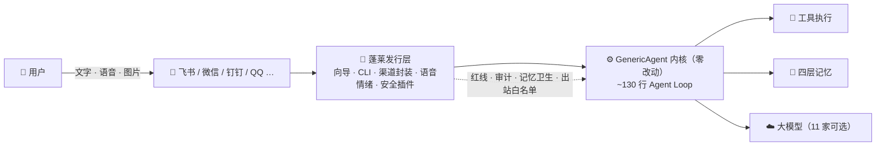

<div align="center">


# 蓬莱 · Penglai

### 住在你飞书和微信里的中文 AI 管家

**八仙过海，各显神通**

[](LICENSE)
[](https://www.python.org/)
[](#)
[](#)
[](https://github.com/lsdefine/GenericAgent)
[](https://penglai.pages.dev/)

**中文** · [English](README_EN.md) · [🌐 官网](https://penglai.pages.dev/)

</div>

> 📌 **官方渠道**：本 GitHub 仓库 · [官网 penglai.pages.dev](https://penglai.pages.dev/)（国内可直接访问，备用镜像 [kevinchennewbee.github.io/PenglaiAgent](https://kevinchennewbee.github.io/PenglaiAgent/)） · PyPI [`penglai`](https://pypi.org/project/penglai) 是仅有的官方分发渠道。其他网站 / 组织 / 个人以「蓬莱 · Penglai」名义提供的内容均非官方，请勿在非官方渠道填入你的 API Key 或凭证。

---

**蓬莱**是一个跑在你自己服务器上的个人 AI 管家：扫码接入你的微信，三分钟接入飞书，
听得出你语音里的情绪，记得住你说过的话，干得了查资料、写代码、跑任务的活——
而且**记忆只属于你**，安全靠确定性红线而不是模型自觉。

一台 $5/月 的云服务器、一个 LLM API Key，十分钟向导走完，你就有了自己的管家。

## 🌊 缘起：一个不会写代码的人，和他的 AI 管家

我做了十年网络技术、网络安全与网络运维，但**不会写代码——一行都不会**。这个仓库里的每一行代码，
都是我用 AI 编程工具一句话一句话"说"出来的。蓬莱本身就是它想证明的那件事：
**AI 时代，普通人也能为自己造工具。**

初心来自真实的痛。作为一个想认真拥抱这场变革的普通用户，我把市面上摸得到的工具
几乎用了个遍，也实打实撞过它们的墙。我见证了 CLI 时代的锋利——Claude Code、
OpenCode、Kimi CLI 个个出色；也看到了桌面时代的完善与流行——Codex 桌面版、Qoder、
WorkBuddy、Claude Cowork 把 Agent 做进了窗口里。它们都很好，但它们都默认同一件事：
**你得坐在电脑前。**

我总想起电脑的来路：DOS 把计算交给会敲命令的人，Windows 的图形界面把它交给会用
鼠标的人，而移动互联网把它装进了每个人的口袋。Agent 正在走同一条路——
**CLI 是它的 DOS，桌面应用是它的 Windows，下一站一定在移动端、在碎片时间里。**
各家的移动 App 会各有精彩，但对普通大众而言，最方便、最简单、每天真实会打开的，
是聊天软件。**会发微信，就该会用 Agent**——不需要再学任何新东西。

[GenericAgent](https://github.com/lsdefine/GenericAgent) 是我见过最干净的 Agent 内核，
所以蓬莱不重造轮子，核心完全站在它的肩膀上。蓬莱要补的是"最后一公里"：
让它跑在你拥有的任何一台机器上——无头云服务器、角落里 24 小时待机的 Mac mini，
Windows 也在路上——然后住进你的飞书和微信，在通勤的地铁上、午休的间隙里，
随叫随到，一直都在。

## 🏝️ 为什么叫「蓬莱」

蓬莱是中国神话里的海上仙山。《史记》记载，渤海之东有三神山——蓬莱、方丈、瀛洲，
仙人居之，藏不死之药；秦始皇曾遣徐福率三千童男童女东渡求访，终未能至。两千年来，
"蓬莱"是中国人对**可望而不可即的美好之地**最古老的想象。

我选这个名字，是因为今天的 AI 之于普通人，恰如蓬莱之于古人：人人听说它神奇，
真正登上去的人却很少——API、终端、配置文件，就是横在海面上的那层迷雾。
**蓬莱想做的，是把仙山搬进你的聊天窗口：你不必学会航海，会发微信，就能上岛。**
AI 时代的仙山，不该只属于会写代码的人。

至于"八仙过海，各显神通"——传说八位神仙各凭自己的法器渡海赴蓬莱——这正是项目的
技术哲学：多模型、多渠道、专家各司其职，每个模型用自己的方式渡海，服务同一个你。

## ✨ 它能做什么

- 🏮 **十分钟开箱** —— `penglai setup` 翻页式向导（中/英双语）：自装依赖（国内自动切清华镜像）→ 选模型测连通 → **渠道一页选**（飞书扫码自动建应用，免开网页）→ 给管家起名 → 能力面板真启用（语音默认装好，陪伴/情报按需开）
- 💬 **飞书 + 微信双渠道，都是扫码** —— 飞书扫码建机器人、长连接免公网 IP；个人微信扫码登录，文字/语音/图片收发
- 🎙️ **听得出情绪的耳朵** —— 本地 CPU 跑 SenseVoice（约 230MB）：语音转写 + 7 种情绪标签（高兴/悲伤/生气/害怕…）+ 声学事件（笑声/哭声/掌声…），`[语音(情绪:低落): 今天好累]` 这样进入对话。**飞书/微信开箱即用；钉钉/QQ/企业微信的语音由发行层补齐**——上游前端只收文字图片，蓬莱层封装了语音接收（钉钉/QQ 还叠加本地 SenseVoice 拿情绪）
- 🧠 **四层记忆** —— 基于 GA 内核的索引/事实/技能/原始会话四层文件式记忆，纯 markdown 可审计；写入前威胁扫描（提示注入/角色劫持/密钥落库），禁止覆盖；长期事实带**时间/来源/重要度签名、新值自动作废旧值**（治过期偏好污染）
- 🛡️ **确定性安全护栏** —— 危险命令与路径红线拦截 + 全量工具调用审计 JSONL——**靠确定性检查，不靠 LLM 自觉**。已覆盖危险命令、敏感路径、记忆写入、文件外发（白名单当前仅覆盖飞书渠道）等关键风险面；护栏 ≠ 绝对安全，建议在个人受控的服务器上运行
- 🔎 **网页搜索开箱即用** —— 内置免费 Bing 兜底，**无头云服务器也能查**天气/新闻/事实（不依赖浏览器）；想要多源交叉验证再 `penglai enable intel` 叠加 TinyFish/Tavily 等独立搜索源
- 🧐 **防幻觉双保险** —— 本地绊线**出厂常开**（免费）：嗅到「过度自信」措辞就拦下自检；`penglai enable critic` 从**整张厂商目录任选**一个**不同厂商**的复核模型（免费如 GLM-4.7-Flash，也可投更强的付费模型换更大视差）——单模型查不出自己的幻觉
- 🧰 **出厂内置技能 + 本地技能集市** —— 管家自带提醒/日程、天气查询、网页文章总结（免 key、无头可用）；`penglai skill` 是本地 apt 式集市（出厂精选、装时过安全扫描、不联网拉）。技能一律是 GA 原生 SOP——外部技能必须先改写成 SOP 才能收编，不是「外面拿来就用」
- 📦 **十分钟搬家（从 Hermes/OpenClaw）** —— `penglai migrate` 把旧管家的记忆/模型/渠道/人设搬过来（预览 + 备份 + 诚实标注搬不了的）
- 🌙 **真主动，不扰民** <sub>opt-in</sub> —— 心跳 + 硬编码门禁的真主动：**恶劣天气预警**、**从语音里听出的情绪主动关心**、早晚问候、久未联系才招呼；勿扰时段、对话中绝不插话、频率上限——像朋友想起你，而不是闹钟响了。投递到飞书和微信
- 🎛️ **能力随时补开** —— 第一次向导没开的，事后一条命令补上：`penglai enable voice|companion|intel` 开能力、`penglai enable <渠道>` 加 IM、`penglai abilities` 看全貌——不必重跑向导
- ⚙️ **运维一个命令** —— `penglai doctor` 一键体检，**未启用的项直接告诉你用哪条命令开** / `status` / `logs` / `update` 一键升级到最新版

> 以上每一条都在真实服务器上每天跑着，不是路线图。

## 🚀 快速开始

新机器只要联网，**一行命令**——没有 Python、没有 git 都不要紧，脚本全自动备好：

```bash
curl -fsSL https://raw.githubusercontent.com/kevinchennewbee/PenglaiAgent/main/install.sh | sh
```

国内网络（走镜像，同样一行）：

```bash
curl -fsSL https://gh-proxy.com/https://raw.githubusercontent.com/kevinchennewbee/PenglaiAgent/main/install.sh | sh
```

🐳 **Docker 党也是一行**——自动取镜像（拉不动 GHCR 就本地构建）→ 交互向导 → 常驻容器（开机自启、挂了自动拉起）→ 连接验证，数据全在 `penglai-data` 卷里，升级不丢：

```bash
curl -fsSL https://gh-proxy.com/https://raw.githubusercontent.com/kevinchennewbee/PenglaiAgent/main/docker-install.sh | sh
```

喜欢自己动手的，传统三段式同样可用：

```bash
git clone https://github.com/kevinchennewbee/PenglaiAgent.git
cd PenglaiAgent
python3 penglai setup    # 向导：语言 → 依赖 → 模型 → 渠道一页选 → 能力面板
```

<div align="center">

<br/><sub>安装向导实景：中英双语、翻页式步骤、渠道一页多选</sub>
</div>

日常运维：

```bash
penglai            # 直接在终端和管家对话（TUI，与飞书/微信共享同一份记忆）
penglai doctor     # 体检：环境/依赖/配置/LLM/记忆/服务/上游
penglai status     # 服务状态（飞书/调度器/陪伴/微信）
penglai logs       # 最近日志（penglai logs dingtalk 看指定渠道）
penglai channels   # IM 渠道矩阵总览
penglai abilities  # 能力总览（语音/陪伴/情报，未开的直接给开启命令）
penglai enable voice|companion|intel   # 事后补开向导没开的能力
penglai migrate    # 从旧管家(Hermes/OpenClaw)搬家：记忆/模型/渠道/人设
penglai skill      # 本地技能集市：list/install/installed/remove（装时安全扫描，不联网）
penglai update     # 安全升级：预检 → 后台重启 → 健康检查 → 失败自动回滚（结果发到你 IM）
```

> 💡 **升级很省心**：`penglai update` 确认后全自动——先编译+安全插件预检拦住坏更新，再由脱离进程的后台监工重启并做连接健康检查，**新版起不来会自动回滚到上一个能跑的版本**，全程结果发到你飞书/微信，不用 SSH 上服务器。你也可以让管家在 IM 里直接说「检查更新 / 升级」。

> 🐳 **Docker 党的日常运维**（容器里没有 systemd，命令略不同）：
> ```bash
> docker logs -f penglai                      # 看日志（出现「收到消息」即收发全通）
> docker exec -it penglai penglai doctor      # 体检（任意 penglai 子命令都可这样跑）
> docker restart penglai                      # 重启容器
> # 升级 = 拉新镜像（不是 git）：重跑下面这行，数据在 penglai-data 卷里不丢
> curl -fsSL https://gh-proxy.com/https://raw.githubusercontent.com/kevinchennewbee/PenglaiAgent/main/docker-install.sh | sh
> ```
> 容器内置常驻监工：扫码绑定、`penglai setup` 补配新渠道后**无需重启容器**，30 秒内自动拉起；进程崩溃自愈。

> 🇨🇳 国内服务器友好：依赖走清华 PyPI 镜像，模型与代码走 gh-proxy，向导自动处理，无需手动配置。

## 💬 渠道矩阵：一个管家，多个门

GA 内核自带 7 个 IM 前端，蓬莱层统一封装为 `penglai enable <渠道>`（依赖安装 → 凭证获取 → 服务安装 → 启动取证一条龙）。所有渠道共享同一份记忆——**同一个管家，多个门**：

| 渠道 | 接入方式 | 语音 | 状态 |
|------|---------|------|------|
| 飞书 | `penglai setup` 向导，**扫码自动建应用** | ✅ 转写+情绪 | ✅ 已实测 |
| 微信（个人号） | `penglai setup` 向导，扫码登录 | ✅ 转写+情绪（silk） | ✅ 已实测 |
| 终端 TUI | 裸跑 `penglai` 即聊 | — | ✅ 内核自带 |
| 钉钉 | `penglai enable dingtalk`，**扫码自动建应用** | 🔧 封装(自带ASR) | ⚠️ 待实测 |
| QQ | `penglai enable qq`，**扫码自动建机器人** | 🔧 封装(wav+情绪) | ⚠️ 待实测 |
| 企业微信 | `penglai enable wecom`，后台建智能机器人贴凭证 | 🔧 封装(自带ASR) | ⚠️ 待实测 |
| Telegram | `penglai enable telegram`，@BotFather 贴 token | — | ⚠️ 待实测 |
| Discord | `penglai enable discord`，开发者后台贴 token | — | ⚠️ 待实测 |

> 「待实测」= 接入代码已就绪（IM 框架为 GA 上游自带，语音接收为蓬莱层封装），但我们还没在真机走完全程——实测过一个就升级成 ✅。诚实比好看重要。
> 语音列：✅=真机验证过；🔧=发行层已封装语音接收（上游前端原本丢弃语音），待真机实测；—=该渠道无语音。

## 🆚 蓬莱 vs 裸 GenericAgent

蓬莱不改内核，只在 GA 之上补齐"从能跑到好用"的最后一公里：

| 维度 | 裸 GenericAgent | 蓬莱发行版 |
|------|----------------|-----------|
| 上手 | 手动改 mykey、装依赖 | 十分钟翻页向导（中英双语、自动镜像） |
| IM 接入 | 自己读前端代码接 | 飞书/微信扫码 + 钉钉/QQ/企微一条命令 |
| 语音 | 无 | 本地 SenseVoice 转写+情绪，全渠道封装 |
| 安全 | 基础 | 红线/记忆卫生/出站文件白名单，确定性防线 |
| 能力管理 | 改配置文件 | `penglai enable / abilities` 事后开关 |
| 安装分发 | git clone | curl / Docker / pip 一行 + 国内自动镜像 |
| 运维 | 手动 | `penglai doctor` 体检并直接给修复命令 |
| 内核 | — | **零改动**，上游升级照常合并 |

## 🧬 架构：站在内核肩膀上

蓬莱构建于 [GenericAgent](https://github.com/lsdefine/GenericAgent)（GA）内核之上——一个被验证过的
~130 行 Agent 循环：`上下文 → LLM → 工具 → 结果回流`。蓬莱与 GA 的关系，如同 Ubuntu 之于 Linux 内核：



- **内核零改动**：`ga.py`、`frontends/`、`llmcore.py`、记忆工具等内核文件保持零 diff，GA 的内核升级照常合并；发行层只在内核之上做裁剪与增补——删掉与发行无关的上游文档/演示，换上蓬莱自己的门面、CLI、插件与 SOP；
- **形态梯度**：新能力优先用 SOP（0 行代码）实现，其次 hook 插件，再次心跳模块，最后才是工具——克制是设计，不是懒；
- **身份与记忆分离**：出厂态零用户记忆，只带一行身份。你的记忆是你的隐私资产，永不进发行版。

| 蓬莱层 | 形态 | 干什么 |
|---|---|---|
| `penglai` CLI + 向导 | 入口 | 安装、体检、服务管理、一键升级 |
| 微信渠道服务 | systemd | 扫码登录、token 过期智能提示（不盲目重启） |
| 语音情绪 | 工具 | SenseVoice 本地转写 + 情绪 + 声学事件，微信 silk 自动解码 |
| IM 语音封装 | 包装入口 | 为钉钉/QQ/企微补上游前端缺失的语音接收（monkeypatch，内核零 diff）|
| 能力开关 | CLI | `penglai enable/disable/abilities` 装机后随时补开语音/陪伴/情报 |
| 红线 + 审计 | hook | 确定性拦截危险操作，全量审计留痕 |
| 记忆卫生 | hook | 写记忆威胁扫描 + 禁覆盖 |
| 网页搜索 | 插件 | 免费 Bing 兜底开箱即用（无头可用）；`enable intel` 叠加多源交叉验证 |
| 批判脑 <sub>smart 档</sub> | hook | 绊线常开（免费）；命中才复核，复核模型从整张厂商目录自选（`penglai enable critic`） |
| 主动陪伴 <sub>opt-in</sub> | 心跳 | 门禁内的真主动：天气预警/语音情绪/早晚问候/久未联系，飞书微信双投递 |
| 蓬莱 SOP 包 | markdown | 符号化断点、可追溯压缩、生成技能——0 行代码 |

> **为什么仓库里还有 GenericAgent 的 `pyproject.toml` 和 `ga` 入口？**
> 因为蓬莱是 GA 的发行版：内核文件（含其构建配置）保持零改动，上游升级才能照常合并。`penglai` 是发行层入口；`ga` / `genericagent` 是上游内核的原生入口，两者共存、互不冲突。内核 bug 请报给[上游](https://github.com/lsdefine/GenericAgent)，发行层问题在本仓库提 issue。

## 🔄 更新承诺：上游的演进，及时到你手里

蓬莱是 [GenericAgent](https://github.com/lsdefine/GenericAgent) 的下游发行版，上游在持续进化，我们替你盯着：

- 🛡️ **安全类更新**：上游修复的安全漏洞，我们确认问题性质与影响面后，**48 小时内**同步进发行仓；
- 🧩 **功能类更新**（新功能与功能维护）：在确认与蓬莱层不冲突、运行稳定的前提下，**72 小时内**同步；
- 你要做的只有一句：`penglai update`（Docker 用户重跑一遍 docker-install.sh，数据在卷里不丢）。

## 📅 最新动态

完整版本时间线见 [官网更新日志](https://penglai.pages.dev/#changelog)。

- **2026-06-14** — v0.2.3：同步上游 GenericAgent（13 提交，内核零 diff，腾讯云真机验证过）——微信 headless 容器登录（二维码直接打到 `docker logs`，无需图形界面）+ TUI 工作区项目模式与 `@` 文件补全 + macOS 无障碍 ljqCtrl 移植
- **2026-06-14** — v0.2.2：一键迁移（`penglai migrate`，从 Hermes/OpenClaw 搬记忆/模型/渠道/人设，**先预览再落盘 + 自动备份**）+ 本地技能集市（`penglai skill`，技能一律是 GA 原生 SOP、装时过安全扫描、不联网拉）+ 出厂内置技能（提醒/天气/网页总结，免 key 无头可用）+ 蓬莱独特记忆（长期事实带**时间/来源/重要度签名、新值自动作废旧值**，治过期偏好污染）+ 主动陪伴加固（投递失败不哑火、办公在线也收得到锚点）+ 一轮对抗式安全自审（修了技能名路径穿越等 4 项）
- **2026-06-13** — v0.2.1：`penglai update` 安全自更新——预检拦坏更新 + 后台监工重启 + 健康检查 + **新版起不来自动回滚** + 结果发到你 IM；管家可在聊天里直接「检查更新/升级」
- **2026-06-13** — v0.2.0：网页搜索免 key 开箱即用（Bing 兜底，无头可用）+ 主动陪伴 v2（天气预警/语音情绪/早晚问候，飞书微信双投递）+ 批判脑复核模型全目录自选 + Docker 常驻监工（扫码/补配自动拉起）
- **2026-06-12** — IM 语音封装（钉钉/QQ/企微，上游真空补齐）+ 能力事后开启 `penglai enable / abilities` + 官网重做 + 全新 banner
- **2026-06-12** — 向导 v2：语言选择打头 / 翻页式终端 / 渠道一页选 / 能力面板真启用 / 语音默认装
- **2026-06-11** — 安全硬化（审计 P0/P1 修复）+ Docker 一键部署 + 11 家国内厂商模型目录
- **2026-06-11** — 🎉 首次开源：十分钟向导、飞书微信扫码、本地语音情绪识别、确定性红线安全

## 📜 许可与品牌

- **代码**：[MIT](LICENSE) 许可。上游 GenericAgent 的版权声明完整保留；蓬莱层代码 © 2026 Kevin Chen，同样以 MIT 发布——随便用、随便改、随便商用。代码与品牌边界详见 [NOTICE](NOTICE)。
- **品牌**：「蓬莱」「Penglai」名称、logo 与横幅视觉资产**保留所有权利**，不在代码许可范围内。未经书面许可，请勿将其用于你的分发版本、衍生产品或商业宣传的命名与标识。
  （开源圈通行做法：代码自由，品牌保留——Rust、Docker 皆如此。）
- **内核来自上游**：`ga.py`、`frontends/`、`llmcore.py`、记忆工具等是 [GenericAgent](https://github.com/lsdefine/GenericAgent) 的内核原文件（零改动保留）；蓬莱在其上做发行层的裁剪与增补。安装入口只有 `install.sh` / `docker-install.sh`（均指向 `kevinchennewbee/PenglaiAgent`）。

## 🙏 致谢

蓬莱站在这些项目的肩膀上：

- [GenericAgent](https://github.com/lsdefine/GenericAgent)（MIT）——内核本身：极简 Agent 循环、L1-L4 记忆、自进化技能树
- [Hermes Agent](https://github.com/NousResearch/hermes-agent)（MIT）——doctor 与安装体验、渠道质量标准、记忆卫生的理念
- [PilotDeck](https://github.com/OpenBMB/PilotDeck)（AGPL，仅借鉴设计理念）——门禁系统与可回滚纪律
- [SenseVoice / FunASR](https://github.com/FunAudioLLM/SenseVoice) · [sherpa-onnx](https://github.com/k2-fsa/sherpa-onnx)——CPU 友好的语音与情绪识别

## ✍️ 关注作者

微信公众号 **KevinAIStack** —— Personal AI Stack 的长期实践笔记：深度思考 · 实用工具 · 开源项目 · 效率提升。
蓬莱的开发幕后、踩坑实录与新版本预告都会在这里首发。

<div align="center">

<br/><sub>微信「搜一搜」KevinAIStack，或扫码关注</sub>
</div>
