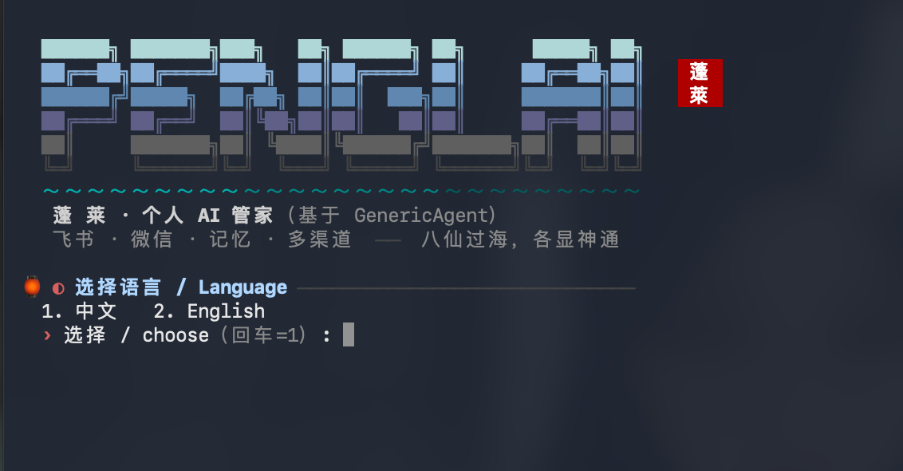
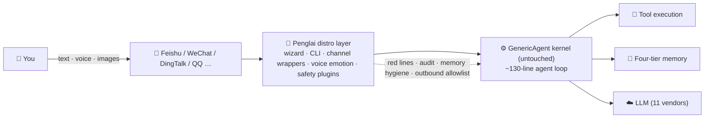

<div align="center">


# Penglai · 蓬莱

### Your personal AI butler, living in Feishu & WeChat

**八仙过海，各显神通** · _where eight immortals cross the sea, each shows their unique power_

[](LICENSE)
[](https://www.python.org/)
[](#)
[](#)
[](https://github.com/lsdefine/GenericAgent)
[](https://penglai.pages.dev/)

[中文](README.md) · **English** · [🌐 Website](https://penglai.pages.dev/)

</div>

> 📌 **Official channels:** this GitHub repo · [penglai.pages.dev](https://penglai.pages.dev/) (mirror: [kevinchennewbee.github.io/PenglaiAgent](https://kevinchennewbee.github.io/PenglaiAgent/)) · PyPI [`penglai`](https://pypi.org/project/penglai) are the only official distribution channels. Anything offered under the name "Penglai / 蓬莱" by other sites / orgs / individuals is unofficial — never enter your API keys or credentials on unofficial channels.

---

**Penglai** is a personal AI butler that runs on your own server: scan a QR code to connect your
WeChat, three minutes to connect Feishu (Lark). It hears the emotion in your voice messages,
remembers what you told it, and gets real work done — research, code, scheduled tasks — while
**your memory belongs to you alone**, guarded by deterministic red lines rather than model goodwill.

One $5/month VPS, one LLM API key, a ten-minute wizard — and you have your own butler.

## 🌊 Origin: built by someone who can't code

I spent ten years in network engineering, security, and operations — and **I can't write code.
Not a single line.** Every line in this repository was "spoken" into existence through AI coding tools.
Penglai itself is the proof of its own thesis: **in the AI era, ordinary people can build their
own tools.**

It began with real pain. As an ordinary user determined to embrace this shift, I tried nearly
every agent tool I could get my hands on — and ran into their walls. I watched the CLI era shine
(Claude Code, OpenCode, Kimi CLI), then watched the desktop era mature and spread (Codex desktop,
Qoder, WorkBuddy, Claude Cowork) as agents moved into windows. They are all excellent. And they
all quietly assume the same thing: **you are sitting at a computer.**

I keep thinking about how personal computing actually unfolded: DOS gave computing to people who
could type commands; Windows gave it to anyone who could move a mouse; the mobile internet put it
in everyone's pocket. Agents are walking the same road — **CLI is their DOS, desktop apps are
their Windows, and the next stop is mobile, inside the fragments of your day.** Every vendor's
mobile app will have its own brilliance, but for ordinary people, the most convenient, simplest
tool they genuinely open every day is the chat app. **If you can text, you can use an agent** —
nothing new to learn.

[GenericAgent](https://github.com/lsdefine/GenericAgent) is the cleanest agent kernel I've seen,
so Penglai doesn't reinvent it — the core stands squarely on GA's shoulders. What Penglai adds is
the last mile: run it on any machine you own — a headless VPS, the Mac mini gathering dust in a
corner, Windows on the way — and let it live in your Feishu and WeChat: on your commute, between
meetings, always there.

## 🏝️ Why "Penglai"?

Penglai (蓬莱) is the legendary immortal island of Chinese mythology. The *Records of the Grand
Historian* tells of three sacred mountains in the eastern sea — Penglai among them — where
immortals dwell and the elixir of life is kept. China's first emperor sent the court sorcerer Xu Fu
with three thousand boys and girls across the sea to find it; they never reached its shores. For two thousand years,
"Penglai" has been the oldest Chinese name for **a wonderful place you can see but never reach.**

I chose the name because AI today is, for ordinary people, exactly what Penglai was to the
ancients: everyone has heard of its magic, yet few ever set foot on it — APIs, terminals, and
config files are the mist that keeps the island out of reach. **Penglai's mission is to move the
immortal island into your chat window: you don't need to learn to sail — if you can text, you
can come ashore.** The wonders of the AI era should not belong only to those who can code.

And the project motto — *"the Eight Immortals cross the sea, each revealing their unique power"*
(八仙过海，各显神通) — comes from the legend of eight immortals who each crossed to Penglai by
their own magic. That is the project's technical philosophy: many models, many channels, many
experts, each crossing the sea in its own way, all serving the same you.

## ✨ What it does

- 🏮 **Ten-minute setup** — a paged, bilingual (EN/中文) wizard (`penglai setup`): auto-installs deps (China-mirror aware) → pick a model & test connectivity → **one-page channel picker** (scan-to-create your Feishu bot, no console clicking) → name your butler → ability panel that actually activates things (voice on by default; companion/intel opt-in)
- 💬 **Feishu + WeChat, both connected by QR code** — Feishu bot created by scanning a QR code, long connection so no public IP needed; personal WeChat via QR login with text/voice/image in & out
- 🎙️ **Ears that hear emotion** — SenseVoice running locally on CPU (~230MB): transcription + 7 emotion tags (happy/sad/angry/fearful…) + acoustic events (laughter/crying/applause…), arriving as `[voice (emotion: down): so tired today]`. **Feishu/WeChat out of the box; DingTalk/QQ/WeCom voice added by the distro layer** — upstream frontends drop voice messages, so Penglai wraps voice reception (DingTalk/QQ also layer on local SenseVoice for emotion)
- 🧠 **Four-tier memory** — the GA kernel's index / facts / skills / raw sessions as plain auditable markdown; every write passes a threat scan (prompt injection / role hijack / secret leakage), overwrites forbidden; long-term facts carry a **timestamp / source / importance signature, and new values auto-retire old ones** (curing stale-preference pollution)
- 🛡️ **Deterministic safety rails** — red-line blocking of dangerous commands & paths plus a full tool-call audit trail in JSONL — **deterministic checks, not LLM goodwill**. Covers dangerous commands, sensitive paths, memory writes and outbound files (allowlist currently Feishu-only); rails ≠ absolute security — run it on a personal, controlled server
- 🔎 **Web search works out of the box** — a built-in free Bing fallback means search works **even on a headless cloud server** (weather/news/facts, no browser needed); want multi-source cross-validation? `penglai enable intel` layers on independent search sources (TinyFish/Tavily/…)
- 🧐 **Double insurance against hallucination** — a local tripwire ships **always-on** (free), sniffing overconfident phrasing; `penglai enable critic` lets you **pick any different-vendor model from the full provider catalog** for cross-review (free like GLM-4.7-Flash, or invest in a stronger paid model for wider parallax) — one model can't catch its own hallucinations
- 🧰 **Built-in factory skills + a local skill marketplace** — the butler ships with reminders/scheduling, weather lookup, and web-article summarization (keyless, headless-ok); `penglai skill` is a local, apt-style marketplace (curated at the factory, security-scanned at install, no network fetch). Skills are always native GA SOPs — an external skill must be rewritten as an SOP before it can be adopted, not "grabbed and run as-is"
- 📦 **Ten-minute move-in (from Hermes/OpenClaw)** — `penglai migrate` brings your old butler's memory/models/channels/persona over (preview + backup + an honest note on what can't be carried)
- 🌙 **Truly proactive, never spammy** <sub>opt-in</sub> — heartbeat + hard-coded gates, with real triggers: **severe-weather alerts**, **picking up on the emotion in your voice messages**, morning/evening check-ins, reaching out only after long silence; quiet hours, never interrupts a live conversation, frequency caps. Delivered to both Feishu and WeChat
- 🎛️ **Turn abilities on anytime** — didn't enable something in the wizard? One command later: `penglai enable voice|companion|intel` for abilities, `penglai enable <channel>` for IMs, `penglai abilities` for the full picture — no need to rerun setup
- ⚙️ **Ops in one command** — `penglai doctor` one-shot health check that **tells you the exact command to enable each inactive item** / `status` / `logs` / `update` one-command upgrade to the latest release

> Every item above runs daily on a real server. This is not a roadmap.

## 🚀 Quick Start

A fresh machine with nothing but an internet connection — **one command**. No Python, no git
required; the script sets up everything automatically:

```bash
curl -fsSL https://raw.githubusercontent.com/kevinchennewbee/PenglaiAgent/main/install.sh | sh
```

From a server inside mainland China (same one-liner, via mirror):

```bash
curl -fsSL https://gh-proxy.com/https://raw.githubusercontent.com/kevinchennewbee/PenglaiAgent/main/install.sh | sh
```

🐳 **Docker, also one line** — pulls the image (falls back to building locally), walks you through
the wizard, then runs as an always-on container (auto-restart, survives reboots). All data lives
in the `penglai-data` volume, so upgrades never lose your config or memory:

```bash
curl -fsSL https://raw.githubusercontent.com/kevinchennewbee/PenglaiAgent/main/docker-install.sh | sh
```

Prefer doing it by hand? The classic way works too:

```bash
git clone https://github.com/kevinchennewbee/PenglaiAgent.git
cd PenglaiAgent
python3 penglai setup    # wizard: language → deps → model → channel picker → ability panel
```

<div align="center">

<br/><sub>The setup wizard in action: bilingual, paged steps, one-page channel picker</sub>
</div>

Day-to-day:

```bash
penglai            # chat with your butler right in the terminal (TUI, shares memory with Feishu/WeChat)
penglai doctor     # health check: env/deps/config/LLM/memory/services/upstream
penglai status     # service status (Feishu / scheduler / companion / WeChat)
penglai logs       # recent logs (penglai logs dingtalk for a specific channel)
penglai channels   # IM channel matrix overview
penglai abilities  # ability overview (voice/companion/intel — inactive ones show the enable command)
penglai enable voice|companion|intel   # turn on abilities you skipped in the wizard
penglai migrate    # move in from an old butler (Hermes/OpenClaw): memory/models/channels/persona
penglai skill      # local skill marketplace: list/install/installed/remove (security-scanned, no network)
penglai update     # safe upgrade: preflight → background restart → health check → auto-rollback on failure
```

> 💡 **Upgrades are hands-off**: after you confirm, `penglai update` runs the whole thing — it preflights (compile + security-plugin mount) to block a broken update, then a detached supervisor restarts services and health-checks the connection. **If the new version won't come up, it auto-rolls-back to the last working one**, and the result is messaged to your Feishu/WeChat — no SSH needed. You can also just tell the butler "check for updates / upgrade" in chat.

> 🐳 **Docker day-to-day** (no systemd inside the container, so commands differ):
> ```bash
> docker logs -f penglai                      # logs ("收到消息" means send/receive works)
> docker exec -it penglai penglai doctor      # health check (any penglai subcommand works this way)
> docker restart penglai                      # restart the container
> # Upgrade = pull a new image (not git): re-run the line below; data in the penglai-data volume is kept
> curl -fsSL https://raw.githubusercontent.com/kevinchennewbee/PenglaiAgent/main/docker-install.sh | sh
> ```
> The container has a resident supervisor: after scan-binding or `penglai setup` adds a new channel, **no container restart needed** — it's auto-started within 30s; crashed processes self-heal.

> 🇨🇳 China-server friendly: deps via the Tsinghua PyPI mirror, models & code via gh-proxy — the
> wizard handles all of it automatically.

## 💬 Channel matrix: one butler, many doors

The GA kernel ships 7 IM frontends; the Penglai layer wraps them behind one command — `penglai enable <channel>` (deps → credentials → service → evidence-based startup). Every channel shares the same memory: **one butler, many doors**.

| Channel | How to connect | Voice | Status |
|---------|---------------|-------|--------|
| Feishu | `penglai setup` wizard, **scan-to-create app** | ✅ transcribe+emotion | ✅ field-tested |
| WeChat (personal) | `penglai setup` wizard, QR login | ✅ transcribe+emotion (silk) | ✅ field-tested |
| Terminal TUI | just run `penglai` | — | ✅ kernel built-in |
| DingTalk | `penglai enable dingtalk`, **scan-to-create app** | 🔧 wrapped (native ASR) | ⚠️ untested |
| QQ | `penglai enable qq`, **scan-to-create bot** | 🔧 wrapped (wav+emotion) | ⚠️ untested |
| WeCom | `penglai enable wecom`, create an AI bot in the console & paste credentials | 🔧 wrapped (native ASR) | ⚠️ untested |
| Telegram | `penglai enable telegram`, paste @BotFather token | — | ⚠️ untested |
| Discord | `penglai enable discord`, paste developer-portal token | — | ⚠️ untested |

> Voice column: ✅ = field-verified; 🔧 = distro-layer voice reception (upstream frontends discard voice), pending real-device test; — = no voice on this channel.

> "Untested" = the adapter is upstream GA code and the Penglai wrapper is ready, but we haven't walked the full path on a real machine yet — each one gets promoted to ✅ as it passes. Honesty over polish.

## 🆚 Penglai vs. bare GenericAgent

Penglai never touches the kernel — it only adds the last mile from "it runs" to "it's usable":

| Dimension | Bare GenericAgent | Penglai distro |
|-----------|-------------------|----------------|
| Onboarding | hand-edit mykey, install deps | ten-minute paged wizard (EN/中文, auto-mirror) |
| IM channels | wire frontend code yourself | Feishu/WeChat QR + DingTalk/QQ/WeCom one command each |
| Voice | none | local SenseVoice transcription + emotion, wrapped for every channel |
| Safety | basic | red-line / memory hygiene / outbound-file allowlist — deterministic |
| Ability mgmt | edit config files | `penglai enable / abilities` toggles, anytime |
| Install | git clone | curl / Docker / pip one-liner + China mirrors |
| Ops | manual | `penglai doctor` checks **and prints the fix command** |
| Kernel | — | **zero diff**, upstream upgrades merge cleanly |

## 🧬 Architecture: standing on a kernel's shoulders

Penglai is built on the [GenericAgent](https://github.com/lsdefine/GenericAgent) (GA) kernel — a
battle-tested ~130-line agent loop: `context → LLM → tools → results flow back`. Penglai is to GA
what Ubuntu is to the Linux kernel:



- **Zero kernel modifications** — the GA kernel files (`ga.py`, `frontends/`, `llmcore.py`, the memory tools …) stay at zero diff, so kernel upgrades merge cleanly; the distro layer only curates the tree on top — dropping upstream docs/demos irrelevant to the distribution and adding Penglai's own front page, CLI, plugins and SOPs;
- **Gradient of forms** — new capabilities prefer SOPs (0 lines of code), then hook plugins, then heartbeat modules, then tools — restraint is a design choice, not laziness;
- **Identity ≠ memory** — factory state ships zero user memory, just one line of identity. Your memory is your private asset and never enters the distribution.

| Penglai layer | Form | What it does |
|---|---|---|
| `penglai` CLI + wizard | entry | install, health check, service management, one-command upgrade |
| WeChat channel service | systemd | QR login; smart expired-token prompts (no blind restarts) |
| Voice + emotion | tool | local SenseVoice transcription + emotion + acoustic events; WeChat silk auto-decode |
| IM voice wrapper | launcher | adds voice reception that upstream DingTalk/QQ/WeCom frontends lack (monkeypatch, zero kernel diff) |
| Ability switches | CLI | `penglai enable/disable/abilities` — turn on voice/companion/intel anytime post-install |
| Redline + audit | hook | deterministic blocking of dangerous ops, full audit trail |
| Memory hygiene | hook | threat scan before writes + no overwrites |
| Web search | plugin | free Bing fallback works out of the box (headless-ok); `enable intel` layers on multi-source cross-validation |
| Critic brain <sub>smart mode</sub> | hook | tripwire always-on (free); on hit, review model picked from the full provider catalog (`penglai enable critic`) |
| Proactive companion <sub>opt-in</sub> | heartbeat | true proactivity inside hard gates: weather alerts / voice emotion / check-ins, delivered to Feishu & WeChat |
| Penglai SOP pack | markdown | symbolic checkpoints, traceable compression, generative skills — 0 lines of code |

> **Why does this repo still contain GenericAgent's `pyproject.toml` and `ga` entry point?**
> Because Penglai is a GA distribution: kernel files (including their build config) stay untouched so upstream upgrades merge cleanly. `penglai` is the distro entry point; `ga` / `genericagent` are the upstream kernel's native entry points — they coexist without conflict. Report kernel bugs [upstream](https://github.com/lsdefine/GenericAgent); file distro issues here.

## 🔄 Update Pledge: upstream progress, delivered to you

Penglai is a downstream distribution of [GenericAgent](https://github.com/lsdefine/GenericAgent). The upstream keeps evolving, and we watch it for you:

- 🛡️ **Security updates**: once we confirm the nature and impact of an upstream security fix, we sync it into this distribution repo **within 48 hours**;
- 🧩 **Feature updates** (new features and maintenance): synced **within 72 hours**, after confirming they don't conflict with the Penglai layer and run stably;
- All you need is one command: `penglai update` (Docker users: re-run docker-install.sh — your data lives in the volume and survives).

## 📅 Latest News

Full version timeline on the [website changelog](https://penglai.pages.dev/#changelog).

- **2026-06-14** — v0.2.2: one-command migration (`penglai migrate` — pull memory/models/channels/persona over from Hermes/OpenClaw, **preview first, then write, with an automatic backup**) + a local skill marketplace (`penglai skill` — skills are always native GA SOPs, security-scanned at install, no network fetch) + built-in factory skills (reminders/weather/web-page summary, keyless and headless-ok) + Penglai's signature memory (long-term facts carry a **timestamp / source / importance signature, and new values auto-retire old ones**, curing stale-preference pollution) + companion hardening (delivery failures no longer go silent; anchors reach you even when you're online at work) + a round of adversarial self-audit (fixed 4 issues including skill-name path traversal)
- **2026-06-13** — v0.2.1: safe `penglai update` — preflight blocks broken updates + background supervisor restart + health check + **auto-rollback if the new version won't start** + result messaged to your IM; the butler can "check for updates / upgrade" right in chat
- **2026-06-13** — v0.2.0: keyless web search out of the box (Bing fallback, headless-ok) + Proactive Companion v2 (weather alerts / voice emotion / check-ins, dual Feishu+WeChat delivery) + critic review model picked from the full catalog + Docker resident supervisor (auto-starts channels after scan/config)
- **2026-06-12** — IM voice wrapper (DingTalk/QQ/WeCom — filling the upstream gap) + on-demand abilities `penglai enable / abilities` + website redesign + new banner
- **2026-06-12** — Wizard v2: language-first / paged terminal / one-page channel picker / ability panel / voice by default
- **2026-06-11** — Security hardening (audit P0/P1 fixes) + one-line Docker deploy + catalog of 11 Chinese model vendors
- **2026-06-11** — 🎉 First release: ten-minute wizard, Feishu/WeChat QR, local voice-emotion recognition, deterministic safety

## 📜 License & Brand

- **Code**: [MIT](LICENSE). Upstream GenericAgent's copyright notice is preserved in full; the Penglai layer is © 2026 Kevin Chen, also released under MIT — use it, change it, sell it. See [NOTICE](NOTICE) for the code/brand boundary.
- **Brand**: the "蓬莱" / "Penglai" name, logo, and banner artwork are **all rights reserved** and not covered by the code license. Please don't use them to name or market your forks, derivatives, or commercial offerings without written permission.
  (The common open-source convention: free code, reserved brand — as practiced by Rust, Docker, and others.)
- **Kernel from upstream**: `ga.py`, `frontends/`, `llmcore.py`, the memory tools, etc. are [GenericAgent](https://github.com/lsdefine/GenericAgent)'s own kernel files (kept at zero diff); Penglai curates and extends on top. The only install entry points are `install.sh` / `docker-install.sh` (both pointing at `kevinchennewbee/PenglaiAgent`).

## 🙏 Acknowledgments

Penglai stands on the shoulders of:

- [GenericAgent](https://github.com/lsdefine/GenericAgent) (MIT) — the kernel itself: the minimalist agent loop, L1-L4 memory, self-evolving skill tree
- [Hermes Agent](https://github.com/NousResearch/hermes-agent) (MIT) — doctor & install experience, channel quality standards, memory hygiene ideas
- [PilotDeck](https://github.com/OpenBMB/PilotDeck) (AGPL, design ideas only) — gate systems and reversibility discipline
- [SenseVoice / FunASR](https://github.com/FunAudioLLM/SenseVoice) · [sherpa-onnx](https://github.com/k2-fsa/sherpa-onnx) — CPU-friendly speech & emotion recognition

## ✍️ Follow the Author

WeChat official account **KevinAIStack** — long-form field notes on building a Personal AI Stack (in Chinese):
deep dives, practical tools, open-source projects. Penglai's behind-the-scenes stories and release previews land there first.

<div align="center">

<br/><sub>Search "KevinAIStack" in WeChat, or scan the QR code</sub>
</div>
